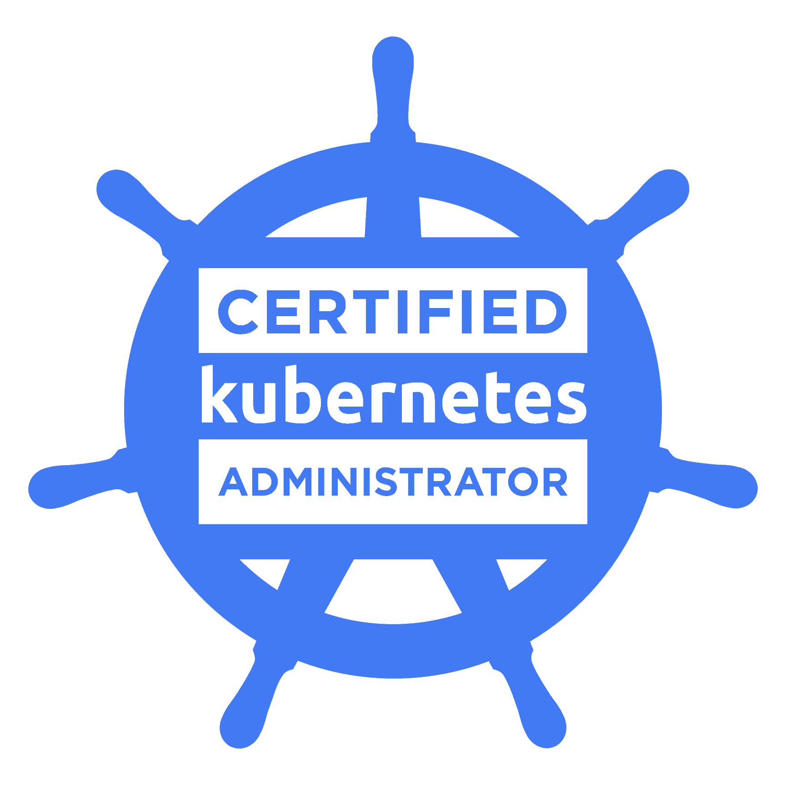

### Hi there, I am Amey! (he/him/his)👋 👋 

<!--STARTS_HERE_QUOTE_README-->
<i>❝Sometimes it is the people no one can imagine anything of who do the things no one can imagine.❞ - Alan Turing ([The Imitation Game](https://www.imdb.com/title/tt2084970/))</i>
<!--ENDS_HERE_QUOTE_README-->

Hi, I'm [Amey Deshmukh](https://www.linkedin.com/in/amey-deshmukh-016a68107/), working as a Site Reliability Engineer at [Infracloud](https://www.infracloud.io/).

### Talking about Personal Stuffs

- 🥅 Goals: 
    - Find some interesting problems and to build solutions around them. 
    - Make them #open-source
    - Programming mostly in Golang.
    - Contribute more to Open Source projects

### SRE/DevOps Tools and Technologies

  
    

   
   
   

   
    
  

### Programming/Scripting Languages

       

 

### 🎖 Certificates

 

### :octocat: Github Statistics

### :card_index: Latest Blog posts
<!-- BLOG-POST-LIST:START -->
- [CKS Exam: Tips and tricks](https://medium.com/@ameydev/cks-exam-tips-and-tricks-30f90c7c38ca?source=rss-d57da9ba885e------2)
- [Hello, world! Just started blogging.](https://medium.com/@ameydev/hello-world-just-started-blogging-34d268cab93?source=rss-d57da9ba885e------2)
<!-- BLOG-POST-LIST:END -->

### :zap: Recent Activity
<!--START_SECTION:activity-->
1. ❗️ Closed issue [#1](https://github.com/ameydev/kv-svc/issues/1) in [ameydev/kv-svc](https://github.com/ameydev/kv-svc)
2. 🗣 Commented on [#1](https://github.com/ameydev/kv-svc/issues/1) in [ameydev/kv-svc](https://github.com/ameydev/kv-svc)
<!--END_SECTION:activity-->

### </img> Connect with me 

